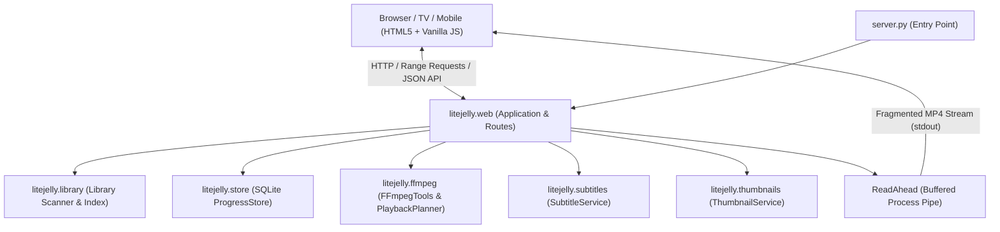

# 🎬 LiteJelly

**Ultra-lightweight, zero-dependency personal media streaming server tailored for budget smart TVs (Cloud TV Lite, Android TV, webOS) and mobile devices.**

---

## 🌟 Overview

Heavy media servers like Plex, Jellyfin, or Emby often struggle on low-spec hardware (such as 32-inch budget smart TVs with 512 MB – 1 GB RAM). Their browser clients are heavy web applications (>10–30 MB JS bundles) that lag, drop frames, or run out of memory.

**LiteJelly** is built from the ground up to solve this:
- **Zero Dependencies**: Pure Python standard library backend (no `pip install` required).
- **Featherweight Frontend**: Under 100 KB total payload (HTML + CSS + Vanilla JS) with zero frameworks or build steps.
- **Smart Transcoding & Remuxing**: Offloads codec heavy-lifting (HEVC/x265, AC-3, DTS, 10-bit) to the host server via portable FFmpeg.
- **10-Foot TV Experience**: Seamless D-pad remote navigation with high-visibility focus indicators, smooth auto-scrolling, and mobile touch gestures.
- **Local Synchronization**: SQLite-backed playback progress (WAL mode) shared instantly across all devices on your local network.

---

## 📐 Architecture & Technology



### Tech Stack
- **Backend**: Python 3.10+ Standard Library (`http.server`, `sqlite3`, `subprocess`, `threading`, `dataclasses`, `pathlib`).
- **Media Engine**: FFmpeg & FFprobe (auto-detected in app folder or on system `PATH`).
- **Frontend**: Vanilla ES6+ JavaScript (IIFE, template cloning, polyfills for older Android TV browsers), semantic HTML5, and responsive CSS3 glassmorphism.
- **Database**: SQLite with WAL (Write-Ahead Logging) enabled.

---

## 🚀 Key Features

### 1. Intelligent Playback Planning
LiteJelly probes every video before streaming to find the fastest, lowest-overhead playback path:
- **Direct Play**: Browser-native containers (MP4, WebM) with H.264 video and AAC/MP3/Opus audio stream directly with HTTP 206 partial content range requests.
- **Direct Remux (Stream Copy)**: Files with compatible H.264 video but incompatible audio (AC-3, DTS, TrueHD) copy the video stream at 0% CPU usage and re-encode only the audio to stereo AAC.
- **Full Transcode**: Incompatible video codecs (HEVC/H.265, 10-bit, MPEG-2, VC-1) are transcoded on-the-fly to standard 720p/1080p H.264 + AAC in fragmented MP4 chunks.
- **Quality Ladder**: User-selectable qualities (`Auto`, `Original`, `1080p`, `720p`, `480p`, `360p`).

### 2. Accurate Seeking & A/V Sync
- **Seek Landing Prediction**: Open-GOP encodes (x265's default) flag CRA frames as keyframes even though they are not valid entry points. FFprobe performs the same seek FFmpeg will, so the player is told where the stream *actually* begins rather than where it was asked to begin.
- **Matched Stream Entry**: FFmpeg's accurate seek trims audio to the exact timestamp, but copied video can only start on a keyframe, leaving the two seconds apart. `-noaccurate_seek` is used for stream copies so both begin at the same point; re-encoded video keeps accurate seek.
- **In-Player Audio Delay Adjuster**: Fine-tune audio synchronisation from the player OSD (-400 ms to +400 ms), applied server-side so it survives seeking.

### 3. Comprehensive Subtitle Engine
- **External Sidecar Subtitles**: Automatic discovery of `.srt`, `.vtt`, `.ass` files in media folders or `subs/` directories.
- **Pure-Python SRT Converter**: Converts SubRip (`.srt`) to WebVTT in-process with multi-encoding fallback (`utf-8-sig`, `utf-16`, `cp1252`, `latin-1`), functioning even if FFmpeg is not installed.
- **Embedded Subtitles**: Automatically extracts embedded text subtitles on-the-fly and caches them as WebVTT.
- **Dynamic Cue Shifting**: Dynamically re-bases subtitle timestamps when playback resumes midway through a stream.
- **Bitmap Burn-in**: Detects image-based subtitles (PGS / VobSub) and offers clean hardware-assisted video burn-in.

### 4. TV Remote & 10-Foot User Interface
- **D-pad Spatial Navigation**: Full keyboard / TV remote arrow key control with grid row/column math.
- **"Continue Watching" Rail**: Automatic progress tracking with visual completion bars on video cards.
- **Rescan & Search**: Instant real-time video search, category format filters (`All`, `MP4`, `MKV`, `Other`), and multi-attribute sorting.
- **Display WakeLock**: Leverages the Screen Wake Lock API to prevent smart TV screens and phones from sleeping during playback.

---

## 📂 Repository Structure

```
lucid-fermi/
├── config.json             # Server and transcoding configuration
├── settings.json           # Written by the admin page; overrides config.json (gitignored)
├── server.py               # CLI entry point and server startup
├── ffmpeg.exe              # Optional portable FFmpeg binary
├── ffprobe.exe             # Optional portable FFprobe binary
│
├── litejelly/              # Core Python package (Zero pip dependencies)
│   ├── __init__.py         # Version info
│   ├── admin.py            # Admin access control: loopback rule, token check, CSRF guard
│   ├── config.py           # Configuration loading, validation, and CLI overrides
│   ├── ffmpeg.py           # Media probe, playback planner, quality ladders, transcode commands
│   ├── library.py          # Media scanner, title cleanup, series grouping, SxxExx parser
│   ├── logs.py             # Verbosity, rotating log file, and reading it back
│   ├── paths.py            # Realpath containment and symlink traversal guards
│   ├── settings.py         # settings.json load/save and admin input validation
│   ├── store.py            # SQLite WAL progress store and continue watching
│   ├── subtitles.py        # Sidecar discovery, SRT->VTT parser, cue shifting, burn-in logic
│   ├── thumbnails.py       # Single-flight thumbnail worker pool with fallback seeking
│   └── web.py              # HTTP server, REST API, ReadAhead ring buffer, streaming pump
│
├── static/                 # Frontend assets (<100 KB total payload)
│   ├── index.html          # Semantic HTML5 layout with accessible templates
│   ├── style.css           # Glassmorphic dark theme, TV focus states, player OSD
│   ├── app.js              # State machine, D-pad navigation, custom video controls
│   ├── admin.html          # Settings page, served at /admin (separate from the TV UI)
│   ├── admin.css           # Desktop-oriented styling for the settings page
│   ├── admin.js            # Settings form, directory picker, save/validation handling
│   ├── favicon.svg         # SVG vector favicon
│   └── site.webmanifest    # Web app manifest for mobile home screen installs
│
├── tests/                  # Automated test suite
│   ├── test_litejelly.py   # Unit tests for containment, ranges, subtitles, and titles
│   ├── test_admin.py       # Settings validation, admin access control, library rebuild
│   ├── test_avsync.py      # Regression tests for the seeking and A/V sync fixes
│   ├── test_grouping.py    # Categories, series identity, episode ordering
│   ├── test_http.py        # Live-server tests over a real socket
│   └── test_logs.py        # Verbosity floor, rotation, log parsing and filtering
│
├── logs/                   # Rotating log files (gitignored)
│
└── tools/                  # Diagnostic and verification utilities
    └── avsync_probe.py     # Diagnostic harness for measuring A/V synchronization drift
```

---

## ⚡ Quick Start

### 1. Prerequisites
- Python 3.10 or higher.
- *(Optional but strongly recommended)*: **FFmpeg & FFprobe**.
  - Drop `ffmpeg.exe` and `ffprobe.exe` directly into the repository root, or ensure they are available on your system `PATH`.

### 2. Run the Server
```bash
# That's it. Everything else is set up in the browser.
python server.py

# Optional: choose the port or bind address
python server.py --host 0.0.0.0 --port 8000

# Optional: seed a folder on first run instead of using the admin page
python server.py --dir "D:\Movies"
```

On the first run the library is empty. Open **`http://127.0.0.1:<port>/admin`**,
add your media folders and save. Settings persist, so from then on
`python server.py` is all you need.

### 3. Open on Your TV or Mobile Device
Upon launch, LiteJelly prints the network URL:
```
============================================================
 LiteJelly 0.2.0
 Local:   http://127.0.0.1:8000
 Network: http://192.168.1.50:8000
 Admin:   http://127.0.0.1:8000/admin
 ffmpeg:  7.1-essentials (ffmpeg.exe)
 ffprobe: 7.1-essentials (ffprobe.exe)
 Videos:  66
 Media directories:
   - [shows] D:\TV Shows
============================================================
```
Type the **Network URL** (e.g., `http://192.168.1.50:8000`) into your TV's browser or mobile browser and bookmark it!

---

## ⚙️ Configuration

Most people never need to edit a file. `config.json` only holds what must be
known before the server can start listening:

```json
{
    "port": 8000,
    "host": "0.0.0.0",
    "admin_token": ""
}
```

Everything else — media folders, transcoding, ffmpeg paths — is set on the
admin page and saved to `settings.json` beside it. Where the two overlap,
`settings.json` wins; command line flags beat both. Delete `settings.json` at
any time to fall back to `config.json` and the built-in defaults.

If you prefer to configure by hand, any admin-page setting can also be written
directly into `config.json`:

```json
{
    "server_name": "LiteJelly",
    "media_dirs": [
        { "path": "D:\\Movies", "content_type": "movies" },
        { "path": "D:\\TV Shows", "content_type": "shows", "label": "TV" },
        "C:\\My Local Drive\\Media"
    ],
    "scan_interval": 60,
    "thumbnail_workers": 2,
    "allow_hevc_direct": false,
    "stream_buffer_mb": 8,
    "ffmpeg_path": "",
    "ffprobe_path": "",
    "transcode": {
        "video_codec": "libx264",
        "audio_codec": "aac",
        "preset": "veryfast",
        "crf": 22,
        "max_video_bitrate": "3000k",
        "audio_bitrate": "160k",
        "resolution": "1280x720",
        "max_concurrent": 2
    }
}
```

A media directory may be a plain path string or an object with a
`content_type` of `mixed`, `movies`, `shows` or `anime`. The tag describes how
the folder should be grouped and presented; plain strings default to `mixed`.

---

## 🔧 Admin Page (`/admin`)

Settings live on their own page at `http://<server>:<port>/admin`, the way Plex
and Jellyfin separate configuration from the viewing experience. There is
deliberately no settings icon in the library UI: someone watching a film on a
TV has no reason to reach the transcoder configuration with a D-pad.

It is grouped into four tabs so the everyday controls are not buried among the
rare ones:

| Tab | Contains |
| :--- | :--- |
| **Library** | Media folders and their content types, scan interval, manual rescan |
| **Playback** | HEVC direct play, default transcode quality |
| **General** | Server name, port and bind address, remote access, status |
| **Logs** | Detail level and a viewer for the recent log |
| **Advanced** | x264 preset and CRF, bitrates, concurrency, stream buffer, log rotation, ffmpeg paths |

Everything except `port` and `host` applies immediately; those two are saved
and reported as needing a restart.

### Reaching it from another device

By default the admin page answers only on the machine running LiteJelly, so
opening `http://192.168.1.50:8000/admin` from your TV returns 403. To allow it:

1. Open `/admin` on the server itself and go to **General → Remote access**.
2. Press **Generate token** (or type your own, 8+ characters, no spaces) and **Save settings**.
3. Use the link the page then shows you:
   `http://<server-ip>:<port>/admin?token=<your-token>`

The token can also be set as `admin_token` in `config.json` if you have no
desktop access to the machine. Treat that URL like a password: anyone with it
can point the server at any folder on the host. The library itself stays
available to the whole network without a token.

**Why the restriction.** The admin API decides which directories the server
hands files out of, so a request that can change it can make the server share
anything on the machine. Writes additionally require a same-origin request, so
another website cannot post to it from your browser.

---

## 📋 Logs

LiteJelly writes to `logs/litejelly.log`, rotating at 2 MB and keeping three
old files by default. The console shows the same lines.

Activity, warnings and errors are always recorded — there is no setting that
hides a failure. The detail level only decides how much *extra* is kept:

| Level | Records |
| :--- | :--- |
| **Normal** (default) | Scans, playback decisions, requests, warnings, errors |
| **Debug** | Plus ffmpeg decisions, skipped files, probe failures |
| **Trace** | Everything, including per-chunk streaming detail |

Change it on **Logs** in the admin page; it applies immediately, without a
restart. `python server.py --verbose` forces debug for a single run without
changing the saved setting.

The terminal stays quiet by default and shows only warnings and errors. Tick
**Also print logs to the terminal** on the Logs tab to mirror everything there,
which is useful when running in the foreground.

The same tab shows the recent log with filtering by severity, so you can look
for errors without reading through every request. Rotation size and how many
old files to keep live under **Advanced → Log file** and need a restart.

---

## 🎮 TV Remote Navigation Guide

| Key / Button | Library View | Player View |
| :--- | :--- | :--- |
| **◀ Left** | Focus previous card | Seek backward 10 seconds |
| **▶ Right** | Focus next card | Seek forward 10 seconds |
| **▲ Up** | Focus card row above | Seek forward 60 seconds |
| **▼ Down** | Focus card row below | Seek backward 60 seconds |
| **OK / Enter** | Open & play selected video | Toggle Play / Pause |
| **Back / Escape** | Clear search / exit | Return to library view |
| **Space** | Play selected video | Toggle Play / Pause |

---

## 🗺️ Project Roadmap

- [x] **Phase 0: Project Documentation & Guidelines**
  - Architecture specifications, comprehensive README, coding conventions.
- [x] **Phase 0.1: Admin Page & Settings**
  - Separate `/admin` page, tagged media directories, live-applied settings.
  - Admin API limited to the local machine unless an `admin_token` is set.
- [ ] **Phase 1: Media Library Grouping & Default Sorting**
  - Default sorting by Episode number (`S01E01`, `S01E02`...).
  - Hierarchical grouping: Shows, Movies, Anime categories + Season & Episode grouping.
- [ ] **Phase 2: Playback Flow & Next Episode Auto-Play**
  - "Up Next" prompt and auto-play transition to the next episode.
  - Multi-audio stream switcher (e.g., Japanese audio vs. English dub).
- [ ] **Phase 3: Metadata Enrichment & Intro Skipping**
  - Local `.nfo` parsing & open API integration (TMDb / TVMaze) for posters, plot summaries, and episode names.
  - Intro / Outro skipping integration (AniSkip / chapter markers).
- [ ] **Phase 4: Hardware Acceleration**
  - Auto-detection for hardware encoders (NVENC, QuickSync, AMF) to achieve near-0% CPU usage during transcoding.

---

## 🧪 Testing & Verification

Run the automated test suite:
```bash
python -m unittest discover -s tests
```

Run the A/V synchronization diagnostic tool:
```bash
python tools/avsync_probe.py .probe 25 32 47.5
```

---

## 📄 License

MIT License. Designed for personal and private home network media streaming.
