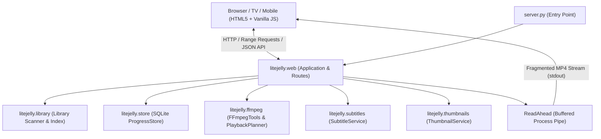

# 🎬 LiteJelly

**Ultra-lightweight, zero-dependency personal media streaming server tailored for budget smart TVs (Cloud TV Lite, Android TV, webOS) and mobile devices.**

---

## 🌟 Overview

Heavy media servers like Plex, Jellyfin, or Emby often struggle on low-spec hardware (such as 32-inch budget smart TVs with 512 MB – 1 GB RAM). Their browser clients are heavy web applications (>10–30 MB JS bundles) that lag, drop frames, or run out of memory.

**LiteJelly** is built from the ground up to solve this:
- **Zero Dependencies**: Pure Python standard library backend (no `pip install` required).
- **Featherweight Frontend**: 178 KB of HTML, CSS and vanilla JavaScript, with no frameworks and no build step. A further 445 KB of self-hosted font is fetched once and then cached for a year, so a return visit is the 178 KB alone. For comparison, the clients this replaces ship 10–30 MB of JavaScript before any of it runs.
- **Smart Transcoding & Remuxing**: Offloads codec heavy-lifting (HEVC/x265, AC-3, DTS, 10-bit) to the host server via portable FFmpeg.
- **10-Foot TV Experience**: The interface sizes itself to the screen it is on, judged by what the device can do rather than by what its user agent claims to be.
- **Local Synchronization**: SQLite-backed playback progress (WAL mode) shared instantly across all devices on your local network.

---

## 📐 Architecture & Technology



### Tech Stack
- **Backend**: Python 3.10+ Standard Library (`http.server`, `sqlite3`, `subprocess`, `threading`, `dataclasses`, `pathlib`).
- **Media Engine**: FFmpeg & FFprobe (auto-detected in app folder or on system `PATH`).
- **Frontend**: Vanilla ES6+ JavaScript (IIFE, template cloning, polyfills for older Android TV browsers), semantic HTML5, and responsive CSS3 glassmorphism.
- **Database**: SQLite with WAL (Write-Ahead Logging) enabled.

---

## 🚀 Key Features

### 1. Intelligent Playback Planning
LiteJelly probes every video before streaming to find the fastest, lowest-overhead playback path:
- **Direct Play**: Browser-native containers (MP4, WebM) with H.264 video and AAC/MP3/Opus audio stream directly with HTTP 206 partial content range requests.
- **Direct Remux (Stream Copy)**: Files with compatible H.264 video but incompatible audio (AC-3, DTS, TrueHD) copy the video stream at 0% CPU usage and re-encode only the audio to stereo AAC.
- **Full Transcode**: Incompatible video codecs (HEVC/H.265, 10-bit, MPEG-2, VC-1) are transcoded on-the-fly to standard 720p/1080p H.264 + AAC in fragmented MP4 chunks.
- **Quality Ladder**: User-selectable qualities (`Auto`, `Original`, `1080p`, `720p`, `480p`, `360p`).

### 2. Accurate Seeking & A/V Sync
- **Seek Landing Prediction**: Open-GOP encodes (x265's default) flag CRA frames as keyframes even though they are not valid entry points. FFprobe performs the same seek FFmpeg will, so the player is told where the stream *actually* begins rather than where it was asked to begin.
- **Matched Stream Entry**: FFmpeg's accurate seek trims audio to the exact timestamp, but copied video can only start on a keyframe, leaving the two seconds apart. `-noaccurate_seek` is used for stream copies so both begin at the same point; re-encoded video keeps accurate seek.
- **In-Player Audio Delay Adjuster**: Fine-tune audio synchronisation from the player OSD (-400 ms to +400 ms), applied server-side so it survives seeking.

### 3. Comprehensive Subtitle Engine
- **External Sidecar Subtitles**: Automatic discovery of `.srt`, `.vtt`, `.ass` files in media folders or `subs/` directories.
- **Pure-Python SRT Converter**: Converts SubRip (`.srt`) to WebVTT in-process with multi-encoding fallback (`utf-8-sig`, `utf-16`, `cp1252`, `latin-1`), functioning even if FFmpeg is not installed.
- **Embedded Subtitles**: Automatically extracts embedded text subtitles on-the-fly and caches them as WebVTT.
- **Dynamic Cue Shifting**: Dynamically re-bases subtitle timestamps when playback resumes midway through a stream.
- **Bitmap Burn-in**: Detects image-based subtitles (PGS / VobSub) and offers clean hardware-assisted video burn-in.

### 4. TV Remote & 10-Foot User Interface

- **Device profiles**: The interface sizes itself to the screen it is on. There is no reliable way to ask a browser "am I a television", so LiteJelly asks what actually changes the design: a wide screen that cannot hover is being driven by a remote from across a room. Type, spacing, focus rings and hit targets all scale from that, and a stray mouse movement corrects a wrong guess.
- **D-pad spatial navigation**: Arrow keys move to the nearest control in that direction, measured geometrically. A hero, rails of differing lengths and a grid share no common column count, so counting columns cannot work.
- **Overscan safe area**: Nothing readable or pressable sits in the outer 5% on a television, because many still clip the edge of the picture.
- **Home screen**: A suggestion with full-width artwork, then one rail per category. A flat alphabetical grid is a file browser, not a library.
- **Series pages**: Poster beside backdrop, season tabs, and one row per episode carrying its own still, synopsis, runtime and air date.
- **"Continue Watching" Rail**: One row per series rather than one per episode, showing the next episode once you finish one.
- **Up Next**: When an episode ends, the following one is offered with a ten second countdown, or Back to library to stop.
- **Skip Intro / Skip Credits**: Taken from the file's own chapter markers when it has them, and from a shared database when it does not. The segments are also drawn on the seek bar, so you can see where the intro and the credits are before you reach them.
- **Artwork in its own shape**: Posters are portrait, episode stills are landscape. Forcing both into one box is what cropped posters to a slice and made every episode of a show look identical.
- **Offline typography**: Inter is served from the machine itself. Static weights, not the variable file, because variable fonts need a newer engine than the target television has.

### Metadata and artwork

LiteJelly reads what is already beside your media, with no API key and no
network:

| File | Used for |
| :--- | :--- |
| `Episode.S01E01.nfo` | Episode title, plot, rating, air date, season/episode numbers |
| `poster.jpg`, `folder.jpg`, `cover.jpg` | Card artwork, taken from the episode's folder or the show's |
| `Episode.S01E01-thumb.jpg` | Artwork for that one episode |
| `fanart.jpg`, `backdrop.jpg` | Background artwork |

A `.nfo` overrides what the filename guessed, field by field, so a file that
only contains a plot will not wipe an episode number the filename got right.
Where there is no artwork, a frame from the video is still generated as before.
Plots are fetched per item rather than shipped with the whole library, which
would otherwise dwarf the payload.

### Online metadata (optional)

Turn on **Library → Online metadata** to fill the gaps for media with no `.nfo`
or poster beside it. It is **off by default**, because it sends your show
titles to a third party, which is your decision rather than the default.

| Source | Used for | Account needed |
| :--- | :--- | :--- |
| [TVmaze](https://www.tvmaze.com) | Television: episode names, plots, ratings, posters, IMDb id | No |
| [AniList](https://anilist.co) | Anime: titles, scores, cover art | No |
| [AniSkip](https://www.aniskip.com) | Anime opening and ending times | No |
| [TheIntroDB](https://theintrodb.org) | Intros, recaps and credits for everything else | No |
| [TMDb](https://www.themoviedb.org) | Films, and shows TVmaze does not have | Free key |
| [OMDb](https://www.omdbapi.com) | The actual IMDb rating | Free key |

The first four work out of the box. The last two are the same pair Jellyfin
ships with, and both need a free key, which you paste into **Library → Online
metadata**:

- **TMDb** — [themoviedb.org](https://www.themoviedb.org/settings/api). Without
  it, films get nothing, since no free film source works without an account.
- **OMDb** — [omdbapi.com](https://www.omdbapi.com/apikey.aspx), emailed to
  you. Without it the rating shown is TVmaze's or AniList's own, not IMDb's.

Anything found locally still wins: a `.nfo` and a `poster.jpg` were put there
deliberately, and a fuzzy title match should not override them.

Lookups run in the background and are cached on disk for a month. Nothing in a
request ever waits on these services, so if one is slow or down the artwork
simply arrives later. Posters are downloaded and served locally rather than
hotlinked, both because the page's CSP is `img-src 'self'` and so the library
keeps working offline.

> Show data is provided by [TVmaze](https://www.tvmaze.com), used under
> [CC BY-SA](https://creativecommons.org/licenses/by-sa/4.0/). Film data is
> provided by [TMDb](https://www.themoviedb.org), which does not endorse or
> certify this product.
- **Rescan & Search**: Instant real-time video search, category format filters (`All`, `MP4`, `MKV`, `Other`), and multi-attribute sorting.
- **Display WakeLock**: Leverages the Screen Wake Lock API to prevent smart TV screens and phones from sleeping during playback.

---

## 📂 Repository Structure

```
lucid-fermi/
├── config.json             # Server and transcoding configuration
├── settings.json           # Written by the admin page; overrides config.json (gitignored)
├── credentials.json        # Admin username and password hash (gitignored)
├── server.py               # CLI entry point and server startup
├── ffmpeg.exe              # Optional portable FFmpeg binary
├── ffprobe.exe             # Optional portable FFprobe binary
│
├── litejelly/              # Core Python package (Zero pip dependencies)
│   ├── __init__.py         # Version info
│   ├── admin.py            # Admin access control: session cookies, CSRF guard
│   ├── auth.py             # Password hashing, credential storage, sessions, lockout
│   ├── chapters.py         # Chapter markers and the Skip intro / credits segments
│   ├── config.py           # Configuration loading, validation, and CLI overrides
│   ├── enrich.py           # Background metadata lookups, kept out of every request
│   ├── ffmpeg.py           # Media probe, playback planner, quality ladders, transcode commands
│   ├── library.py          # Media scanner, title cleanup, series grouping, SxxExx parser
│   ├── logs.py             # Verbosity, rotating log file, and reading it back
│   ├── metadata.py         # Kodi .nfo sidecars and local artwork discovery
│   ├── paths.py            # Realpath containment and symlink traversal guards
│   ├── providers.py        # TVmaze, AniList, AniSkip, TheIntroDB, TMDb and OMDb clients with a versioned on-disk cache
│   ├── settings.py         # settings.json load/save and admin input validation
│   ├── store.py            # SQLite WAL progress store and continue watching
│   ├── subtitles.py        # Sidecar discovery, SRT->VTT parser, cue shifting, burn-in logic
│   ├── thumbnails.py       # Single-flight thumbnail worker pool with fallback seeking
│   └── web.py              # HTTP server, REST API, ReadAhead ring buffer, streaming pump
│
├── static/                 # Frontend assets, no build step and no CDN
│   ├── index.html          # Semantic HTML5 layout with accessible templates
│   ├── style.css           # Device profiles, tile shapes, player OSD, @supports layer
│   ├── app.js              # State machine, spatial navigation, custom video controls
│   ├── admin.html          # Settings page, served at /admin (separate from the TV UI)
│   ├── admin.css           # Settings page styling, sharing the library's tokens
│   ├── admin.js            # Settings form, directory picker, save/validation handling
│   ├── fonts/              # Self-hosted Inter (SIL Open Font License 1.1)
│   ├── favicon.svg         # SVG vector favicon
│   └── site.webmanifest    # Web app manifest for mobile home screen installs
│
├── tests/                  # Automated test suite
│   ├── test_litejelly.py   # Unit tests for containment, ranges, subtitles, and titles
│   ├── test_admin.py       # Settings validation, admin access control, library rebuild
│   ├── test_auth.py        # Password hashing, credential storage, sessions, lockout
│   ├── test_avsync.py      # Regression tests for the seeking and A/V sync fixes
│   ├── test_chapters.py    # Chapter parsing and skip-segment selection
│   ├── test_grouping.py    # Categories, series identity, episode ordering
│   ├── test_http.py        # Live-server tests over a real socket
│   ├── test_logs.py        # Verbosity floor, rotation, log parsing and filtering
│   ├── test_metadata.py    # .nfo parsing and artwork discovery
│   ├── test_nextup.py      # Next episode selection and the resume rail
│   ├── test_providers.py   # Online metadata parsing, caching and failure handling
│   └── test_thumbnails.py  # Background generation, caching, failure handling
│
├── logs/                   # Rotating log files (gitignored)
│
└── tools/                  # Diagnostic and verification utilities
    └── avsync_probe.py     # Diagnostic harness for measuring A/V synchronization drift
```

---

## ⚡ Quick Start

### 1. Prerequisites
- Python 3.10 or higher.
- *(Optional but strongly recommended)*: **FFmpeg & FFprobe**.
  - Drop `ffmpeg.exe` and `ffprobe.exe` directly into the repository root, or ensure they are available on your system `PATH`.

### 2. Run the Server
```bash
# That's it. Everything else is set up in the browser.
python server.py

# Optional: choose the port or bind address
python server.py --host 0.0.0.0 --port 8000

# Optional: seed a folder on first run instead of using the admin page
python server.py --dir "D:\Movies"
```

On the first run the library is empty. Open **`http://127.0.0.1:<port>/admin`**,
add your media folders and save. Settings persist, so from then on
`python server.py` is all you need.

### 3. Open on Your TV or Mobile Device
Upon launch, LiteJelly prints the network URL:
```
============================================================
 LiteJelly 0.2.0
 Local:   http://127.0.0.1:8000
 Network: http://192.168.1.50:8000
 Admin:   http://127.0.0.1:8000/admin
 ffmpeg:  7.1-essentials (ffmpeg.exe)
 ffprobe: 7.1-essentials (ffprobe.exe)
 Videos:  66
 Media directories:
   - [shows] D:\TV Shows
============================================================
```
Type the **Network URL** (e.g., `http://192.168.1.50:8000`) into your TV's browser or mobile browser and bookmark it!

---

## ⚙️ Configuration

Most people never need to edit a file. `config.json` only holds what must be
known before the server can start listening:

```json
{
    "port": 8000,
    "host": "0.0.0.0"
}
```

Everything else — media folders, transcoding, ffmpeg paths — is set on the
admin page and saved to `settings.json` beside it. Where the two overlap,
`settings.json` wins; command line flags beat both. Delete `settings.json` at
any time to fall back to `config.json` and the built-in defaults.

If you prefer to configure by hand, any admin-page setting can also be written
directly into `config.json`:

```json
{
    "server_name": "LiteJelly",
    "media_dirs": [
        { "path": "D:\\Movies", "content_type": "movies" },
        { "path": "D:\\TV Shows", "content_type": "shows", "label": "TV" },
        "C:\\My Local Drive\\Media"
    ],
    "scan_interval": 60,
    "thumbnail_workers": 2,
    "allow_hevc_direct": false,
    "stream_buffer_mb": 8,
    "ffmpeg_path": "",
    "ffprobe_path": "",
    "transcode": {
        "video_codec": "libx264",
        "audio_codec": "aac",
        "preset": "veryfast",
        "crf": 22,
        "max_video_bitrate": "3000k",
        "audio_bitrate": "160k",
        "resolution": "1280x720",
        "max_concurrent": 2
    }
}
```

A media directory may be a plain path string or an object with a
`content_type` of `mixed`, `movies`, `shows` or `anime`. The tag describes how
the folder should be grouped and presented; plain strings default to `mixed`.

---

## 🔧 Admin Page (`/admin`)

Settings live on their own page at `http://<server>:<port>/admin`, the way Plex
and Jellyfin separate configuration from the viewing experience. There is
deliberately no settings icon in the library UI: someone watching a film on a
TV has no reason to reach the transcoder configuration with a D-pad.

It is grouped into four tabs so the everyday controls are not buried among the
rare ones:

| Tab | Contains |
| :--- | :--- |
| **Library** | Media folders and their content types, scan interval, online metadata, manual rescan |
| **Playback** | HEVC direct play, default transcode quality |
| **General** | Server name, port and bind address, admin account, status |
| **Logs** | Detail level and a viewer for the recent log |
| **Advanced** | x264 preset and CRF, bitrates, concurrency, stream buffer, log rotation, ffmpeg paths |

Everything except `port` and `host` applies immediately; those two are saved
and reported as needing a restart.

### Signing in

The first time you open `/admin`, LiteJelly asks you to create an admin
username and password. **This can only be done on the machine running the
server.** Otherwise whoever reached a freshly started server first would claim
it, which is a race, not a security model.

After that the settings are reachable from any device on the network by
signing in — a TV, a laptop, your phone. The library itself needs no sign-in
and stays open to everyone on the LAN, as before.

Forgot the password? Run `python server.py --reset-admin` on the server to set
a new one.

**How it is protected.** Passwords are stored as a salted PBKDF2-SHA256 hash
in `credentials.json`, never in plain text, and that file is written
owner-readable only. Signing in issues an `HttpOnly`, `SameSite=Strict`
session cookie so the slow hash runs once rather than on every request. Eight
failed attempts lock an address out for fifteen minutes, which matters because
the hash is deliberately expensive: unlimited guessing would also be a way to
burn the server's CPU. Changing the password signs out every other device.

**Why any of this.** The admin API decides which directories the server hands
files out of, so a request that can change it can make the server share
anything on the machine. Writes additionally require a same-origin request, so
another website cannot post to it from your browser.

---

## 📋 Logs

LiteJelly writes to `logs/litejelly.log`, rotating at 2 MB and keeping three
old files by default. The console shows the same lines.

Activity, warnings and errors are always recorded — there is no setting that
hides a failure. The detail level only decides how much *extra* is kept:

| Level | Records |
| :--- | :--- |
| **Normal** (default) | Scans, playback decisions, requests, warnings, errors |
| **Debug** | Plus ffmpeg decisions, skipped files, probe failures |
| **Trace** | Everything, including per-chunk streaming detail |

Change it on **Logs** in the admin page; it applies immediately, without a
restart. `python server.py --verbose` forces debug for a single run without
changing the saved setting.

The terminal stays quiet by default and shows only warnings and errors. Tick
**Also print logs to the terminal** on the Logs tab to mirror everything there,
which is useful when running in the foreground.

The same tab shows the recent log with filtering by severity, so you can look
for errors without reading through every request. Rotation size and how many
old files to keep live under **Advanced → Log file** and need a restart.

---

## 🎮 TV Remote Navigation Guide

| Key / Button | Library View | Player View |
| :--- | :--- | :--- |
| **◀ Left** | Focus the nearest control to the left | Seek backward 10 seconds |
| **▶ Right** | Focus the nearest control to the right | Seek forward 10 seconds |
| **▲ Up** | Focus the nearest control above | Seek forward 60 seconds |
| **▼ Down** | Focus the nearest control below | Seek backward 60 seconds |
| **OK / Enter** | Open & play selected video | Toggle Play / Pause |
| **Back / Escape** | Clear search / exit | Return to library view |
| **Space** | Play selected video | Toggle Play / Pause |
| **N / P** | — | Next / previous episode |
| **S** | — | Skip intro or credits when offered |

Focus moves to whichever control is nearest in the direction pressed, measured
from where things actually are on screen. The home view mixes a hero, rails of
differing lengths and a grid, so "move one column" has no meaning there.

---

## 🗺️ Roadmap

Everything above is built and working. This is what is not, roughly in the
order it is worth doing. Each entry says what it buys and what it costs,
because on a phone-hosted server those are usually in tension.

### Playback

- **Pre-remux to MP4 on demand.** Cache a stream-copied MP4 beside the cache
  for files that only fail direct play on their container or audio codec. This
  is the single highest-value item: it makes those files direct-play, which
  means the browser seeks them itself and start-up stops waiting on a pipe.
  It also fixes seek precision, which HLS would not: HLS cuts at segment
  boundaries, so seeking still snaps, whereas a direct-played file decodes and
  discards to the exact frame. Costs disk.
- **Keyframe-aware skip targets.** A stream copy can only begin on a keyframe,
  so a skip currently lands on the keyframe *before* the target and can replay
  what you asked to skip. Measured on a ten-second-GOP file, asking to jump
  seven seconds landed back on the same frame. Rounding forward instead, with
  a limit so it cannot eat the scene, fixes the case that feels broken.
- **Audio track switching.** Japanese audio against an English dub. Forces a
  remux, and browser `audioTracks` support is unreliable, so it needs the
  server to select the track rather than the client.
- **Hardware encoders.** NVENC, QuickSync, AMF and VAAPI, detected with a real
  one-frame encode rather than by reading `ffmpeg -encoders`, which lists
  encoders that then fail at runtime. Worth a lot on a desktop GPU and very
  little on the Android box, where the encoders are mostly unreachable.

### Library

- **Mark watched and unwatched.** The progress store already records a
  `finished` flag and the API already accepts it; there is simply no control
  for it. Small, and removes the need to scrub to the end of something you
  have already seen.
- **Paging or streaming the library payload.** The whole library is sent in one
  response. That is fine for hundreds of files and will not be for thousands,
  on a device with this much memory.
- **Prune orphaned artwork.** Downloaded posters, backdrops and portraits are
  never removed, so art for deleted media lingers in the cache forever.
- **Cast as a way in.** Portraits are shown but do nothing. The data to filter
  a library by actor is already fetched and cached.
- **Better search.** Matching is a plain substring test, so accents, initials
  and word order all defeat it.

### Interface

- **Test the browser code.** `app.js` is around 2,500 lines with no automated
  coverage at all, and a call to a function that did not exist reached a real
  user because a `ReferenceError` only fires when the button is pressed. A
  headless smoke test of the main journeys would have caught it.
- **Subtitle timing offset.** Audio delay can be nudged from the player;
  subtitles cannot, and a badly muxed file often needs exactly that.
- **A real suggestion.** The home hero currently picks the best-looking
  unstarted title and rotates daily. It is a spotlight, not a recommendation.
  Genres and watch history are both already available to do better.

### Operations

- **Clear the metadata cache from the admin page.** Records carry a schema
  version now, so an upgrade refetches them automatically, but there is still
  no way to force a refresh when a lookup matched the wrong show.
- **Back up and restore settings.** `settings.json` and `credentials.json` are
  the whole configuration; exporting them should not require a file manager.
- **Optional server statistics.** CPU, memory and active streams on the admin
  page. Genuinely useful on a phone that may be thermally throttling, and
  deliberately absent today rather than faked.

---

## 🧪 Testing & Verification

Run the automated test suite:
```bash
python -m unittest discover -s tests
```

Run the A/V synchronization diagnostic tool:
```bash
python tools/avsync_probe.py .probe 25 32 47.5
```

---

## 📄 License

MIT License. Designed for personal and private home network media streaming.
