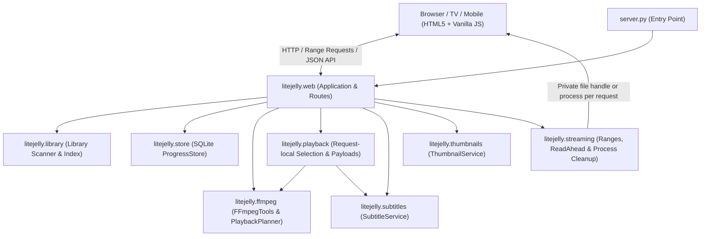

# 🎬 LiteJelly

**Ultra-lightweight, zero-dependency personal media streaming server tailored for budget smart TVs (Cloud TV Lite, Android TV, webOS) and mobile devices.**

---

## 🌟 Overview

Heavy media servers like Plex, Jellyfin, or Emby often struggle on low-spec hardware (such as 32-inch budget smart TVs with 512 MB – 1 GB RAM). Their browser clients are heavy web applications (>10–30 MB JS bundles) that lag, drop frames, or run out of memory.

**LiteJelly** is built from the ground up to solve this:
- **Zero Dependencies**: Pure Python standard library backend (no `pip install` required).
- **Featherweight Frontend**: 193 KB of HTML, CSS and vanilla JavaScript for the whole player and library, with no frameworks and no build step. A further 445 KB of self-hosted font is fetched once and then cached for a year, so a return visit is the 193 KB alone. For comparison, the clients this replaces ship 10–30 MB of JavaScript before any of it runs.
- **Smart Transcoding & Remuxing**: Offloads codec heavy-lifting (HEVC/x265, AC-3, DTS, 10-bit) to the host server via portable FFmpeg.
- **10-Foot TV Experience**: The interface sizes itself to the screen it is on, judged by what the device can do rather than by what its user agent claims to be.
- **Shared Resume History**: SQLite-backed playback progress (WAL mode) shared across devices. Active playback remains independent; saved progress is one record per video, not a separate record per viewer.

---

## 📐 Architecture & Technology


```mermaid
graph TD
    Client["Browser / TV / Mobile (HTML5 + Vanilla JS)"]
    Server["server.py (Entry Point)"]
    Web["litejelly.web (Application & Routes)"]
    Playback["litejelly.playback (Request-local Selection & Payloads)"]
    Lib["litejelly.library (Library Scanner & Index)"]
    Store["litejelly.store (SQLite ProgressStore)"]
    FFmpeg["litejelly.ffmpeg (FFmpegTools & PlaybackPlanner)"]
    Subs["litejelly.subtitles (SubtitleService)"]
    Thumbs["litejelly.thumbnails (ThumbnailService)"]
    Transport["litejelly.streaming (Ranges, ReadAhead & Process Cleanup)"]

    Client <-->|"HTTP / Range Requests / JSON API"| Web
    Server --> Web
    Web --> Lib
    Web --> Store
    Web --> FFmpeg
    Web --> Playback
    Playback --> FFmpeg
    Playback --> Subs
    Web --> Subs
    Web --> Thumbs
    Web --> Transport
    Transport -->|"Private file handle or process per request"| Client
```

### Tech Stack
- **Backend**: Python 3.10+ Standard Library (`http.server`, `sqlite3`, `subprocess`, `threading`, `dataclasses`, `pathlib`).
- **Media Engine**: FFmpeg & FFprobe (auto-detected in app folder or on system `PATH`).
- **Frontend**: Vanilla ES6+ JavaScript (IIFE, template cloning, polyfills for older Android TV browsers), semantic HTML5, and responsive CSS3 glassmorphism.
- **Database**: SQLite with WAL (Write-Ahead Logging) enabled.

### Playback ownership

`web.py` resolves media IDs, validates HTTP input, enforces access rules and
adds progress, episode navigation and skip data to responses. `playback.py`
selects request-local quality, tracks, dialogue mode and seek behavior, and
builds playback details and FFmpeg commands. `ffmpeg.py` owns codec policy,
probe caching and subprocess launch primitives. `streaming.py` owns byte-range
reads, per-request process output, backpressure and cleanup.

Shared probe results contain file facts such as duration, codecs and available
tracks. They do not contain a viewer's position or selections. On the client,
`player-session.js` owns the active playback lifetime and invalidates stale
requests when the viewer exits or switches titles. There is no frontend build
step and these changes add no server dependencies.

---

## 🚀 Key Features

### 1. Intelligent Playback Planning
LiteJelly probes every video before streaming to find the fastest, lowest-overhead playback path:
- **Direct Play**: Browser-native containers (MP4, WebM) with H.264 video and AAC/MP3/Opus audio stream directly with HTTP 206 partial content range requests.
- **Direct Remux (Stream Copy)**: Compatible video is copied without video re-encoding; incompatible audio (AC-3, DTS, TrueHD) can be re-encoded to stereo AAC. Copying, demuxing and audio processing still consume resources.
- **Full Transcode**: Incompatible video codecs (HEVC/H.265, 10-bit, MPEG-2, VC-1) are transcoded on-the-fly to standard 720p/1080p H.264 + AAC in fragmented MP4 chunks.
- **Quality Ladder**: User-selectable qualities (`Auto`, `Original`, `1080p`, `720p`, `480p`, `360p`).
- **Hardware encoding, chosen by measurement**: NVENC, QuickSync, AMF, VAAPI and Media Foundation are offered only if they survive a real timed encode, because `ffmpeg -encoders` cheerfully lists encoders that fail the moment you use them. On this laptop it lists five that do not run. `Auto` times software too and keeps whichever was fastest - which was not always the GPU.

### 2. Accurate Seeking & A/V Sync
- **A real timeline, not a restarted pipe**: A piped fMP4 handed to `<video src>` has no timeline to seek within, so every seek used to restart FFmpeg. The same pipe fed through MediaSource gives the browser absolute timestamps: a seek inside the buffer costs no network request at all, and a distant one costs exactly one. Anything that goes wrong drops back to the plain path for the rest of that playback.
- **Seek Landing Prediction**: Open-GOP encodes (x265's default) flag CRA frames as keyframes even though they are not valid entry points. FFprobe performs the same seek FFmpeg will, so the player is told where the stream *actually* begins rather than where it was asked to begin.
- **Matched Stream Entry**: FFmpeg's accurate seek trims audio to the exact timestamp, but copied video can only start on a keyframe, leaving the two seconds apart. `-noaccurate_seek` is used for stream copies so both begin at the same point; re-encoded video keeps accurate seek.
- **Timing adjuster**: One panel for both streams, a millisecond at a time if you want it. The step size cycles through 1, 10, 50, 250 and 1000 ms, so a small correction and a large one both take a few presses. Subtitles shift instantly in the browser; audio delay is applied by FFmpeg and so takes effect once you stop pressing.
- **Hover readout on the seek bar**: The time under the pointer is shown before you click, rather than after you have landed somewhere else.
- **Picture previews while scrubbing**: One sprite sheet per file, built from keyframes only, so you seek to a shot rather than to a number. Measured at roughly 0.3s of CPU per minute of video - a 24-minute episode costs about seven seconds and 224 KB.
- **Skips land forward, not back**: A stream copy can only begin on a keyframe, so a skip used to land on the keyframe *before* the target and replay what you asked to skip. Measured on a ten-second-GOP file, asking to jump seven seconds returned to the same frame. Skips now take the first verified entry point at or after the target.
- **Two quick changes do not restart the film**: A restart reads the clock, and the clock reads zero while one is in flight - measured at a 61ms window on a fast desktop. A second press inside it used to resume from zero. The target is now held until the new source is playing.

### 3. Sound
- **Audio track selection**: Japanese against an English dub, commentary against the feature. The server selects the track, because browser `audioTracks` support cannot be relied on.
- **Dialogue levelling**: Two presets for films that whisper and then explode. Measured gap between quiet and loud passages: 22 dB untouched, 10.5 dB on Boost, 5.5 dB on Night, at no measurable CPU cost. Single-pass `loudnorm` was tried and rejected - it made quiet dialogue *quieter* at six times the CPU - and `acompressor` clipped.
- **Per-show track memory**: The dub you picked for episode one is the dub for episode two. Choices are remembered per series rather than globally, which is what stopped "subtitles off" on one film from turning them off everywhere. Each menu says whose preference it is holding and offers to drop it.

### 4. Comprehensive Subtitle Engine
- **External Sidecar Subtitles**: Automatic discovery of `.srt`, `.vtt`, `.ass` files in media folders or `subs/` directories.
- **Pure-Python SRT Converter**: Converts SubRip (`.srt`) to WebVTT in-process with multi-encoding fallback (`utf-8-sig`, `utf-16`, `cp1252`, `latin-1`), functioning even if FFmpeg is not installed.
- **Embedded Subtitles**: Automatically extracts embedded text subtitles on-the-fly and caches them as WebVTT.
- **Fetched once, for the whole film**: Cue timings used to be re-based by the server for whatever point the stream had restarted at, which meant refetching the entire subtitle file on every seek — measured at eight fetches for eight seeks. The player's clock is already absolute, so one copy in the file's own timeline now serves the whole playback and a seek costs nothing.
- **Survives a failed fetch**: A `<track>` whose download fails is dead permanently — zero cues, and re-enabling it loads nothing, which is why toggling subtitles off and on could not always bring them back. A failed track is replaced rather than re-enabled, and retried at 2s, 6s and 15s before it says so.
- **Adjustable subtitle delay**: Cues are selected in the browser rather than left to the video element, so the offset can be nudged without refetching anything. Useful when the file itself drifts, which no server-side fix can repair.
- **Add one from the player**: A file with no subtitles, or with the wrong ones, is fixable without reaching the media folder. The Subtitles menu takes an `.srt`, `.vtt` or `.ass` from whatever device you are watching on and keeps it beside the video. It is offered even when the list is empty, which is when it is actually needed.
- **Or fetch one from OpenSubtitles**: Search by title, or by the file's own hash, which matches a release far more reliably than a name does. Results are listed with their release name and download count rather than picked for you, because the top hit is often for a different cut. Needs a free API key and the account it belongs to, set up on the admin page; downloads count against that account's daily quota, so nothing is fetched until you choose one.
- **Neither is taken on trust**: Both paths go through the same check before anything is written. A shell script named `subtitles.srt` is refused, the extension is decided by what the text actually is, the name on disk is built from the video's own path, and an existing file is never overwritten. Adding a subtitle needs an admin session, because it writes into a media folder.
- **Bitmap Burn-in**: Detects image-based subtitles (PGS / VobSub) and offers clean hardware-assisted video burn-in.

### 5. TV Remote & 10-Foot User Interface

- **Device profiles**: The interface sizes itself to the screen it is on. There is no reliable way to ask a browser "am I a television", so LiteJelly asks what actually changes the design: a wide screen that cannot hover is being driven by a remote from across a room. Type, spacing, focus rings and hit targets all scale from that, and a stray mouse movement corrects a wrong guess.
- **D-pad spatial navigation**: Arrow keys move to the nearest control in that direction, measured geometrically. A hero, rails of differing lengths and a grid share no common column count, so counting columns cannot work.
- **Overscan safe area**: Nothing readable or pressable sits in the outer 5% on a television, because many still clip the edge of the picture.
- **Home screen**: A suggestion with full-width artwork, then one rail per category. A flat alphabetical grid is a file browser, not a library. The large slot never repeats what is in Continue watching directly beneath it, and it does not call itself a recommendation, because nothing behind it knows anything about your taste.
- **Search that matches how a title is remembered**: Accents are folded, punctuation becomes a gap and words match in any order, so "pokemon" finds "Pokémon" and "dragon s2e3" finds the episode. `s02e03`, `s2e3` and `2x03` are the same query. A run-together copy of each title is kept so "shield" finds "S.H.I.E.L.D.".
- **Filter by what you have seen**: Unwatched, in progress, finished - and by genre, which comes from metadata already fetched. The old filters sorted by container, which told you about the file rather than about the film.
- **Series pages**: Poster beside backdrop, season tabs, and one row per episode carrying its own still, synopsis, runtime and air date.
- **"Continue Watching" Rail**: One row per series rather than one per episode, showing the next episode once you finish one.
- **Up Next**: The next episode is offered in the corner before the current one ends - at the credits where their position is known, otherwise thirty seconds out - so the picture never goes black first. The episode keeps playing behind it, and dismissing it leaves it dismissed.
- **Mark as watched**: A toggle on every episode row, for the one you watched somewhere else or abandoned halfway.
- **Player controls grouped by purpose**: Previous and next together, picture and sound settings together. Only the two controls that report a value carry a word; the rest are icons, with the chosen subtitle track named on the button and cut to fit.
- **Skip Intro / Skip Credits**: Taken from the file's own chapter markers when it has them, and from a shared database when it does not. The segments are also drawn on the seek bar, so you can see where the intro and the credits are before you reach them.
- **Artwork in its own shape**: Posters are portrait, episode stills are landscape. Forcing both into one box is what cropped posters to a slice and made every episode of a show look identical.
- **Offline typography**: Inter is served from the machine itself. Static weights, not the variable file, because variable fonts need a newer engine than the target television has.

### Metadata and artwork

LiteJelly reads what is already beside your media, with no API key and no
network:

| File | Used for |
| :--- | :--- |
| `Episode.S01E01.nfo` | Episode title, plot, rating, air date, season/episode numbers |
| `poster.jpg`, `folder.jpg`, `cover.jpg` | Card artwork, taken from the episode's folder or the show's |
| `Episode.S01E01-thumb.jpg` | Artwork for that one episode |
| `fanart.jpg`, `backdrop.jpg` | Background artwork |

A `.nfo` overrides what the filename guessed, field by field, so a file that
only contains a plot will not wipe an episode number the filename got right.
Where there is no artwork, a frame from the video is still generated as before.
Plots are fetched per item rather than shipped with the whole library, which
would otherwise dwarf the payload.

### Online metadata (optional)

Turn on **Library → Online metadata** to fill the gaps for media with no `.nfo`
or poster beside it. It is **off by default**, because it sends your show
titles to a third party, which is your decision rather than the default.

| Source | Used for | Account needed |
| :--- | :--- | :--- |
| [TVmaze](https://www.tvmaze.com) | Television: episode names, plots, ratings, posters, IMDb id | No |
| [AniList](https://anilist.co) | Anime: titles, scores, cover art | No |
| [AniSkip](https://www.aniskip.com) | Anime opening and ending times | No |
| [TheIntroDB](https://theintrodb.org) | Intros, recaps and credits for everything else | No |
| [TMDb](https://www.themoviedb.org) | Films, and shows TVmaze does not have | Free key |
| [OMDb](https://www.omdbapi.com) | The actual IMDb rating | Free key |

The first four work out of the box. The last two are the same pair Jellyfin
ships with, and both need a free key, which you paste into **Library → Online
metadata**:

- **TMDb** — [themoviedb.org](https://www.themoviedb.org/settings/api). Without
  it, films get nothing, since no free film source works without an account.
- **OMDb** — [omdbapi.com](https://www.omdbapi.com/apikey.aspx), emailed to
  you. Without it the rating shown is TVmaze's or AniList's own, not IMDb's.

Anything found locally still wins: a `.nfo` and a `poster.jpg` were put there
deliberately, and a fuzzy title match should not override them.

Lookups run in the background and are cached on disk for a month. Nothing in a
request ever waits on these services, so if one is slow or down the artwork
simply arrives later. Posters are downloaded and served locally rather than
hotlinked, both because the page's CSP is `img-src 'self'` and so the library
keeps working offline. Cached records carry a schema version, so an upgrade
that reads a new field refetches rather than serving a record that predates
it. Images no record mentions any more are removed on the next scan.

> Show data is provided by [TVmaze](https://www.tvmaze.com), used under
> [CC BY-SA](https://creativecommons.org/licenses/by-sa/4.0/). Film data is
> provided by [TMDb](https://www.themoviedb.org), which does not endorse or
> certify this product.
- **Rescan & Search**: Instant real-time video search, category format filters (`All`, `MP4`, `MKV`, `Other`), and multi-attribute sorting.
- **Display WakeLock**: Leverages the Screen Wake Lock API to prevent smart TV screens and phones from sleeping during playback.

---

## 📂 Repository Structure

```
lucid-fermi/
├── config.json             # Server and transcoding configuration
├── settings.json           # Written by the admin page; overrides config.json (gitignored)
├── credentials.json        # Admin username and password hash (gitignored)
├── server.py               # CLI entry point and server startup
├── ffmpeg.exe              # Optional portable FFmpeg binary
├── ffprobe.exe             # Optional portable FFprobe binary
│
├── litejelly/              # Core Python package (Zero pip dependencies)
│   ├── __init__.py         # Version info
│   ├── admin.py            # Admin access control: session cookies, CSRF guard
│   ├── admin_routes.py     # Admin and account handlers: setup, sign-in, settings, keys
│   ├── auth.py             # Password hashing, credential storage, sessions, lockout
│   ├── chapters.py         # Chapter markers and the Skip intro / credits segments
│   ├── config.py           # Configuration loading, validation, and CLI overrides
│   ├── enrich.py           # Background metadata lookups, kept out of every request
│   ├── ffmpeg.py           # Media probe, playback planner, quality ladders, transcode commands
│   ├── library.py          # Media scanner, title cleanup, series grouping, SxxExx parser
│   ├── logs.py             # Verbosity, rotating log file, and reading it back
│   ├── metadata.py         # Kodi .nfo sidecars and local artwork discovery
│   ├── net.py              # Public-address HTTPS connections and checked redirects
│   ├── opensubtitles.py    # Subtitle search and download, and the account it needs
│   ├── paths.py            # Realpath containment and symlink traversal guards
│   ├── playback.py         # Request-local playback options, payloads and commands
│   ├── providers.py        # TVmaze, AniList, AniSkip, TheIntroDB, TMDb and OMDb clients with a versioned on-disk cache
│   ├── settings.py         # settings.json load/save and admin input validation
│   ├── store.py            # Durable progress, media identities and legacy database migration
│   ├── streaming.py        # Per-viewer ranges, buffered output and process cleanup
│   ├── subtitles.py        # Sidecar discovery, SRT->VTT parser, cue shifting, burn-in logic
│   ├── thumbnails.py       # Single-flight thumbnail worker pool with fallback seeking
│   ├── trickplay.py        # Sprite sheets of frames for the seek-bar preview
│   └── web.py              # Application lifecycle, HTTP validation and API orchestration
│
├── static/                 # Frontend assets, no build step and no CDN
│   ├── index.html          # Semantic HTML5 layout with accessible templates
│   ├── style.css           # Device profiles, tile shapes, player OSD, @supports layer
│   ├── app.js              # State machine, spatial navigation, custom video controls
│   ├── player-session.js   # Playback lifetime, operation cancellation and held timeline
│   ├── admin.html          # Settings page, served at /admin (separate from the TV UI)
│   ├── admin.css           # Settings page styling, sharing the library's tokens
│   ├── admin.js            # Settings form, directory picker, save/validation handling
│   ├── fonts/              # Self-hosted Inter (SIL Open Font License 1.1)
│   ├── favicon.svg         # SVG vector favicon
│   └── site.webmanifest    # Web app manifest for mobile home screen installs
│
├── tests/                  # Automated test suite
│   ├── test_litejelly.py   # Unit tests for containment, ranges, subtitles, and titles
│   ├── test_admin.py       # Settings validation, admin access control, library rebuild
│   ├── test_audio.py       # Audio track listing, selection and per-show memory
│   ├── test_auth.py        # Password hashing, credential storage, sessions, lockout
│   ├── test_avsync.py      # Regression tests for the seeking and A/V sync fixes
│   ├── test_browse.py      # Watch-state chips, genres, and what the hero may show
│   ├── test_chapters.py    # Chapter parsing and skip-segment selection
│   ├── test_frontend.py    # Browser code: undefined calls, missing ids, browser floor
│   ├── test_grouping.py    # Categories, series identity, episode ordering
│   ├── test_http.py        # Live-server tests over a real socket
│   ├── test_hwaccel.py     # Encoder discovery, self-test, and the auto choice
│   ├── test_identity.py    # Stable root identity and WAL-safe storage migration
│   ├── test_lifecycle.py   # Cancellation, reconfiguration and request limits
│   ├── test_levelling.py   # Dialogue levelling modes and their effect on the plan
│   ├── test_logs.py        # Verbosity floor, rotation, log parsing and filtering
│   ├── test_metadata.py    # .nfo parsing and artwork discovery
│   ├── test_net.py         # Redirect, TLS and public-IP connection policy
│   ├── test_nextup.py      # Next episode selection and the resume rail
│   ├── test_opensubtitles.py # Search, download and the credential file, against a stub
│   ├── test_providers.py   # Online metadata parsing, caching and failure handling
│   ├── test_restart.py     # Restarting the pipe without losing your place
│   ├── test_subtitle_upload.py # What may be written into a media folder, and by whom
│   ├── test_subtitles.py   # One fetch per film, and recovery from a failed one
│   ├── test_thumbnails.py  # Background generation, caching, failure handling
│   └── test_trickplay.py   # Sprite sheets, tile geometry, queue limits
│
├── data/                   # Durable litejelly.db: progress and media identities (gitignored)
├── .cache/                 # Regenerable media assets; legacy database retained after migration
├── logs/                   # Rotating log files (gitignored)
│
└── tools/                  # Diagnostic and verification utilities
    ├── avsync_probe.py     # Diagnostic harness for measuring A/V synchronization drift
    ├── hero_fixture.ps1    # Throwaway library of films and episodes for browser checks
    ├── subtitle_fixture.ps1 # MKV carrying a real embedded subtitle stream
    ├── upload_fixture.ps1  # A video with no subtitles, and files to add to it
    ├── mutate_browse.ps1   # Breaks each browse assertion to prove the tests catch it
    ├── mutate_restart.ps1  # The same, for the restart race
    ├── mutate_subtitles.ps1 # The same, for the subtitle fetching rules
    ├── mutate_subtitle_upload.ps1 # The same, for what may be written to disk
    ├── mutate_safety.ps1   # Identity, reconfiguration and outbound-request safeguards
    ├── mutate_performance.ps1 # The measured performance fixes
    ├── measure_library.py  # Scan and library-response cost at a chosen library size
    └── mutate_opensubtitles.ps1   # The same, for the search and download rules
```

---

## ⚡ Quick Start

### 1. Prerequisites
- Python 3.10 or higher.
- *(Optional but strongly recommended)*: **FFmpeg & FFprobe**.
  - Drop `ffmpeg.exe` and `ffprobe.exe` directly into the repository root, or ensure they are available on your system `PATH`.

### 2. Run the Server
```bash
# That's it. Everything else is set up in the browser.
python server.py

# Optional: choose the port or bind address
python server.py --host 0.0.0.0 --port 8000

# Optional: serve a folder for this run without saving it
python server.py --dir "D:\Movies"
```

`--dir` replaces the saved media folders for that run only, and says so in the
log when saved folders exist. Saving the admin page while it is in effect
stores whatever the form then shows.

On the first run the library is empty. Open **`http://127.0.0.1:<port>/admin`**,
add your media folders and save. Settings persist, so from then on
`python server.py` is all you need.

### 3. Open on Your TV or Mobile Device
Upon launch, LiteJelly prints the network URL:
```
============================================================
 LiteJelly 0.2.0
 Local:   http://127.0.0.1:8000
 Network: http://192.168.1.50:8000
 Admin:   http://127.0.0.1:8000/admin
 ffmpeg:  7.1-essentials (ffmpeg.exe)
 ffprobe: 7.1-essentials (ffprobe.exe)
 Videos:  66
 Media directories:
   - [shows] D:\TV Shows
============================================================
```
Type the **Network URL** (e.g., `http://192.168.1.50:8000`) into your TV's browser or mobile browser and bookmark it!

---

## ⚙️ Configuration

Most people never need to edit a file. `config.json` only holds what must be
known before the server can start listening:

```json
{
    "port": 8000,
    "host": "0.0.0.0"
}
```

Everything else — media folders, transcoding, ffmpeg paths — is set on the
admin page and saved to `settings.json` beside it. Where the two overlap,
`settings.json` wins; command line flags beat both. Delete `settings.json` at
any time to fall back to `config.json` and the built-in defaults.

If you prefer to configure by hand, any admin-page setting can also be written
directly into `config.json`:

```json
{
    "server_name": "LiteJelly",
    "media_dirs": [
        { "path": "D:\\Movies", "content_type": "movies" },
        { "path": "D:\\TV Shows", "content_type": "shows", "label": "TV" },
        "C:\\My Local Drive\\Media"
    ],
    "scan_interval": 60,
    "thumbnail_workers": 2,
    "allow_hevc_direct": false,
    "stream_buffer_mb": 8,
    "ffmpeg_path": "",
    "ffprobe_path": "",
    "transcode": {
        "video_codec": "libx264",
        "audio_codec": "aac",
        "preset": "veryfast",
        "crf": 22,
        "max_video_bitrate": "3000k",
        "audio_bitrate": "160k",
        "resolution": "1280x720",
        "max_concurrent": 2
    }
}
```

A media directory may be a plain path string or an object with a
`content_type` of `mixed`, `movies`, `shows` or `anime`. The tag describes how
the folder should be grouped and presented; plain strings default to `mixed`.

---

## 🔧 Admin Page (`/admin`)

Settings live on their own page at `http://<server>:<port>/admin`, the way Plex
and Jellyfin separate configuration from the viewing experience. There is
deliberately no settings icon in the library UI: someone watching a film on a
TV has no reason to reach the transcoder configuration with a D-pad.

It is grouped into five tabs so the everyday controls are not buried among the
rare ones:

| Tab | Contains |
| :--- | :--- |
| **Library** | Media folders and their content types, scan interval, online metadata, manual rescan, clearing or forgetting a wrong metadata match, OpenSubtitles account |
| **Playback** | HEVC direct play, default transcode quality, hardware encoder and its self-test, scrub previews |
| **General** | Server name, port and bind address, admin account, status, settings backup and restore |
| **Logs** | Detail level and a viewer for the recent log |
| **Advanced** | x264 preset and CRF, bitrates, concurrency, stream buffer, log rotation, ffmpeg paths |

Two of those are worth calling out. The encoder self-test runs a real timed
encode rather than trusting `ffmpeg -encoders`, and reports the speed it
actually measured. And "forget this match" exists because a lookup that lands
on the wrong show is otherwise permanent: it clears the cached records for
that title so the next scan can try again.

API keys are not called ready because a field is filled in. TMDb and OMDb keys
are checked with the provider when entered, when the page opens, and on
**Test key**; the result is Ready, Rejected (with the provider's reason) or
Couldn't check when the service is unreachable. OpenSubtitles reads Ready only
after a sign-in with the saved account succeeds. A refused or unreachable
lookup is no longer remembered as "no match", so fixing a key takes effect on
the next scan.

Everything except `port` and `host` applies immediately; those two are saved
and reported as needing a restart.

### Multiple screens and resource limits

Two screens can watch the same file at different positions, with different
quality and audio selections. Direct streams have separate file handles;
FFmpeg-based streams have separate child processes and buffers. Seeking or
disconnecting one screen does not stop another. Sharing a probe only avoids
repeating the same file inspection; it does not share a playback stream.

Saved progress is different: there is one database record per video and the
most recent saved update wins. Concurrent viewers can overwrite the future
resume position or watched status without moving each other's active playback.
Per-viewer profiles and independent resume histories are not implemented.

| Resource | Limit and behavior |
| :--- | :--- |
| FFmpeg streams | `transcode.max_concurrent`, default 2, counts both remux and transcode streams. A full limit waits up to 20 seconds, then responds with HTTP 503 and `Retry-After: 5`. |
| Direct playback | Does not consume an FFmpeg slot; it still consumes HTTP connections, disk and network bandwidth. |
| Stream buffer | `stream_buffer_mb`, default 8 MiB queued per FFmpeg stream, plus an in-flight chunk and OS/socket buffers. This is not a total process-memory limit. |
| HTTP connections | 64 active connections, including playback and API traffic. Socket idle timeout is 15 seconds, not a total stream-duration limit. |
| Background previews | Bounded thumbnail/trickplay queues and workers. Decoder, filter and encoder stages request one thread each; these are not a global CPU budget or playback-priority scheduler. |

Changing the stream limit preserves occupied slots. Raising it does not make
the CPU or network faster; use playback observations on the actual host and
clients to choose a value. HEAD requests do not launch an FFmpeg stream.

### Storage upgrade and safety

Progress and media identity now live in `data/litejelly.db`, separately from
regenerable assets in `.cache/`. On the first upgraded start, SQLite's backup
API copies the old `.cache/litejelly.db`, including committed WAL data. The old
database is retained and is not overwritten by later progress updates. An
existing durable database is never replaced by the legacy copy.

Before that first start, stop the old server, back up its database, keep the
configured folder order unchanged, and attach the usual media drives. The
first persisted catalog retains the legacy IDs for the available files; later
scans bind them to the same canonical root and relative path. Reordering folders
then preserves IDs, progress and browser preferences. The old schema contains
no root mapping, so earlier misattribution or unavailable files during this
first catalog cannot be reconstructed reliably. Moving or renaming media is
not automatically recognized as the same file.

Startup no longer deletes history for files absent from a scan. Once migration
is verified, clearing generated caches does not clear watch history. Back up
`data/` with the server stopped, or use SQLite's backup API while running;
copying just an open database file can miss WAL transactions. A failed migration
keeps the source and removes its temporary output. If the process is forcibly
killed during migration, a `.migration-lock` may remain beside the new database:
remove it only after confirming no server is running and preserving the old database.

The admin settings export is not a full server backup. Preserve `settings.json`
and `config.json` alongside the durable database when moving a server. Admin
credentials in `credentials.json` and the OpenSubtitles account in
`opensubtitles.json` are separate sensitive files, excluded from settings
exports; protect their permissions and never commit them. Do not delete existing
credentials or `data/` as part of cache cleanup.

Settings changes retain occupied stream slots rather than creating a fresh
allowance. Thumbnail and trickplay shutdown discard queued jobs without waiting
for queue space; active FFmpeg jobs receive cancellation. Only complete images
are published. Metadata workers stop accepting jobs and detach their callbacks;
an in-flight network request may still finish under its network timeout.

HTTP handling is limited to 64 active connections with a 15-second socket idle
timeout. Unsupported transfer framing, duplicate Content-Length headers and
nonfinite or excessive seek values are rejected. This is not a total request
deadline, and the intentionally open library remains intended for trusted LANs.

Subtitle uploads reserve a free filename exclusively before publishing their
complete temporary file. Empty reservations and sidecars resolving outside the
video's directory tree are excluded from discovery. Subtitle responses require
HTTP revalidation because positional external-track IDs can change when files
are added.

Metadata and subtitle downloads use direct public HTTPS connections, validate
redirects, and connect to the already-checked IP address while preserving TLS
hostname verification. Environment proxy settings are not used by these clients.
OpenSubtitles download destinations must additionally belong to
`opensubtitles.com` or `opensubtitles.org`; an unfamiliar CDN is refused rather
than silently trusted. Credentialed redirects cannot change host. Live provider
compatibility still needs verification with a real account.

### Signing in

The first time you open `/admin`, LiteJelly asks you to create an admin
username and password. **This can only be done on the machine running the
server.** Otherwise whoever reached a freshly started server first would claim
it, which is a race, not a security model.

After that the settings are reachable from any device on the network by
signing in — a TV, a laptop, your phone. The library itself needs no sign-in
and stays open to everyone on the LAN, as before.

Forgot the password? Run `python server.py --reset-admin` on the server to set
a new one. The same command repairs a damaged `credentials.json`: if that file
exists but cannot be read, setup stays closed rather than letting anyone at the
server create a fresh account.

**How it is protected.** Passwords are stored as a salted PBKDF2-SHA256 hash
in `credentials.json`, never in plain text, and that file is written
owner-readable only. Signing in issues an `HttpOnly`, `SameSite=Strict`
session cookie so the slow hash runs once rather than on every request. Eight
failed attempts lock an address out for fifteen minutes, which matters because
the hash is deliberately expensive: unlimited guessing would also be a way to
burn the server's CPU. Changing the password signs out every other device.

**Why any of this.** The admin API decides which directories the server hands
files out of, so a request that can change it can make the server share
anything on the machine. Writes additionally require a same-origin request, so
another website cannot post to it from your browser.

### Security model: a trusted home network

LiteJelly is built for a home LAN where everyone who can reach the port is
allowed to watch. Plan around these facts:

- **The library is open.** Browsing, playback, subtitles, thumbnails and saved
  progress need no sign-in. Anyone who reaches the port can play every
  configured folder, start FFmpeg work, and change watch history.
- **Do not port-forward it or expose it to the internet.** For use away from
  home, reach your LAN through a VPN instead, which keeps this model intact.
  A VPN needs an app on each phone or laptop, and most TVs cannot run one.
  Browser-only access from outside, with nothing installed on the viewing
  device, would need viewer sign-in, HTTPS through a reverse proxy, trusted-
  proxy handling and request limits. LiteJelly does not have those yet.
- **Running it behind a reverse proxy is not supported yet.** Every request
  would appear to come from the proxy. Before an admin account exists, that
  would let any proxied client use the setup that is meant for the server's own
  keyboard, and every client would share one sign-in lockout.
- **An admin session is server-level trust.** It chooses which folders are
  served, reads logs, and can point the FFmpeg path at any program the server's
  account can run. Treat the admin password like the server's own login.
- **Traffic is plain HTTP**, including the admin password when signing in.
  The session cookie therefore has no `Secure` flag.

Settings apply all-or-nothing: if new settings cannot be applied, the previous
ones stay in use and `settings.json` is restored.

---

## 📋 Logs

LiteJelly writes to `logs/litejelly.log`, rotating at 2 MB and keeping three
old files by default. The console shows the same lines.

Activity, warnings and errors are always recorded — there is no setting that
hides a failure. The detail level only decides how much *extra* is kept:

| Level | Records |
| :--- | :--- |
| **Normal** (default) | Scans, playback decisions, requests, warnings, errors |
| **Debug** | Plus ffmpeg decisions, skipped files, probe failures |
| **Trace** | Everything, including per-chunk streaming detail |

Change it on **Logs** in the admin page; it applies immediately, without a
restart. `python server.py --verbose` forces debug for a single run without
changing the saved setting.

The terminal stays quiet by default and shows only warnings and errors. Tick
**Also print logs to the terminal** on the Logs tab to mirror everything there,
which is useful when running in the foreground.

The same tab shows the recent log with filtering by severity, so you can look
for errors without reading through every request. Rotation size and how many
old files to keep live under **Advanced → Log file** and need a restart.

---

## 🎮 TV Remote Navigation Guide

| Key / Button | Library View | Player View |
| :--- | :--- | :--- |
| **◀ Left** | Focus the nearest control to the left | Seek backward 10 seconds |
| **▶ Right** | Focus the nearest control to the right | Seek forward 10 seconds |
| **▲ Up** | Focus the nearest control above | Volume up |
| **▼ Down** | Focus the nearest control below | Volume down |
| **OK / Enter** | Open & play selected video | Toggle Play / Pause |
| **Back / Escape** | Clear search / exit | Return to library view |
| **Space** | Play selected video | Toggle Play / Pause |
| **N / P** | — | Next / previous episode |
| **S** | — | Skip intro or credits when offered |
| **C / Q / A** | — | Subtitles / quality / timing |
| **M** | — | Mute |
| **F** | — | Fullscreen |

Focus moves to whichever control is nearest in the direction pressed, measured
from where things actually are on screen. The home view mixes a hero, rails of
differing lengths and a grid, so "move one column" has no meaning there.

---

## 🗺️ Roadmap

Everything above is built and working. This is what is not, roughly in the
order it is worth doing. Each entry says what it buys and what it costs,
because on a phone-hosted server those are usually in tension.

### Playback

- **Pre-remux to MP4 on demand.** Cache a stream-copied MP4 beside the cache
  for files that only fail direct play on their container or audio codec, so
  the browser seeks them itself. Deliberately not built: for watch-once viewing
  it spends disk and a wait up front to improve a seek that the buffered
  stream already handles well. Worth revisiting only for files watched often.
- **A caps handshake for Safari.** MediaSource is unavailable on iPhone before
  17.1, so those fall back to the classic pipe and seek by restarting it. HLS
  would fix it and costs a segmenter, so it needs the capability negotiation
  first rather than a browser sniff.

### Library

- **Paging the library payload.** The whole library is sent in one response,
  gzipped when the browser accepts it: measured at 46 KB for 1,000 files and
  442 KB for 10,000 (5.4 MB uncompressed). That is fine on a LAN; paging is
  worth it only if a real library on a real TV shows the parse to be slow.
- **Cast as a way in.** Portraits are shown but do nothing. The data to filter
  a library by actor is already fetched and cached.
- **More than one viewer.** Progress and watched state are shared by everyone
  using the server, so two people watching the same series overwrite each
  other's resume point. Audio and subtitle choices are remembered per browser.

### Interface

- **Checks on real devices.** Headless journeys run the real client and
  admin page against fixture APIs and a simulated media clock. Decoding, A/V
  sync and remote-control behaviour on an actual TV are still checked by hand.
- **A real suggestion.** The hero no longer claims to be one - it says plainly
  that a title is unstarted - but genres and watch history are both available
  to do better than ranking by artwork.
- **Subtitle appearance.** Size, colour and background are fixed. On a TV
  across a room the size in particular wants to be adjustable.
- **A coarse seek on the remote.** Up and down are volume now, so there is no
  one-press minute jump. Holding left or right is the workaround.

### Operations

- **Optional server statistics.** CPU, memory and active streams on the admin
  page. Genuinely useful on a phone that may be thermally throttling, and
  deliberately absent today rather than faked.

---

## 🧪 Testing & Verification

Run the automated test suite:
```bash
python -m unittest discover -s tests
```

The default suite needs no pip packages or external services; the staged-hook
tests require Git. HTTP tests use
isolated loopback servers; media tests use generated fixtures and skip when
their optional tools are unavailable. `tests/test_frontend.py` checks source
structure, element references and selected compatibility rules. Those checks
do not execute JavaScript and cannot certify browser behavior.

The multi-screen HTTP tests exercise distinct byte ranges and concurrent child
processes at different seek offsets. They verify that seeking or disconnecting
one viewer leaves another running, that direct playback works when FFmpeg slots
are busy, and that failed starts release capacity. Child processes emit controlled
fixture bytes, not encoded video: these tests prove server-side isolation and
cleanup, not codec quality or synchronized A/V on physical screens. Playback API
checks preserve quality, dialogue mode, audio trim, burn-in URLs and resume fields.
Run this slice with `python -m unittest discover -s tests -p test_http.py -v`.

A textual check is only worth having if it fails when the thing it describes
breaks, so the ones guarding a fixed bug come with a script beside them that
breaks it deliberately and confirms the suite notices:
```bash
powershell -NoProfile -ExecutionPolicy Bypass -File tools/mutate_subtitles.ps1
powershell -NoProfile -ExecutionPolicy Bypass -File tools/mutate_subtitle_upload.ps1
powershell -NoProfile -ExecutionPolicy Bypass -File tools/mutate_opensubtitles.ps1
powershell -NoProfile -ExecutionPolicy Bypass -File tools/mutate_restart.ps1
powershell -NoProfile -ExecutionPolicy Bypass -File tools/mutate_browse.ps1
powershell -NoProfile -ExecutionPolicy Bypass -File tools/mutate_safety.ps1
```
Each script delegates to `tools/mutation_runner.py`, which copies source and
tests to a temporary directory. The original worktree is never mutated. A
clean baseline is required, and only assertion failures with the same test
count qualify as caught mutations. Missing or ambiguous targets, survivors,
test errors, skips and timeouts fail the command. Windows-specific newline
mutations are explicitly marked and run on Windows in CI.

Earlier scripts could mistake PowerShell's stderr wrapper for a failed test.
The runner now consumes a structured unittest report instead of searching
console output for words such as "Error". Its own regression tests exercise
passing, failing, malformed and interrupted runs in child processes.

### Optional browser regression suite

Browser checks use the pinned development-only dependency in
`tools/requirements-browser.txt`. It is not imported by the server or the
default suite. No startup or test command installs tools automatically.
Obtain explicit approval before installing packages, browsers or virtual
environments on a developer's machine.

If that tooling is already present, run:
```bash
python -m unittest discover -s tests/browser -v
```
On Windows, the existing isolated environment can run it with
`.venv/Scripts/python.exe -m unittest discover -s tests/browser -v`.

These tests execute the real HTML, CSS and client JavaScript in headless
Chromium. All API responses and media-clock events are controlled fixtures;
no request reaches a real library or third-party service. They cover library
search, rapid dialogue changes, reversed response ordering, player exit and
subtitle placement across screen shapes. A negative control removes the
restart clock guard from the test-served script and reproduces a zero target.
Screenshots and traces are written to the ignored `test-results/browser/`.

The GitHub Actions workflow runs the default suite on Windows and Linux with
Python 3.10 and 3.13, mutation checks on Windows, and the optional browser suite
on a hosted Windows runner. Only that hosted browser job installs the pinned
test tooling. Browser traces and screenshots are retained when its tests fail.

These fixtures do not certify real codec decoding, GPU composition, A/V sync,
TV remote behavior or the live OpenSubtitles API. Those require separate
device/media checks. Thor's subtitle placement fix was confirmed by the user
on the affected laptop on 2026-10-01.

`tools/subtitle_fixture.ps1` and `tools/hero_fixture.ps1` generate throwaway
libraries - an MKV carrying a real embedded subtitle stream, a set of films and
episodes - for checking playback behaviour in a browser without needing a
media collection.

Run the A/V synchronization diagnostic tool:
```bash
python tools/avsync_probe.py .probe 25 32 47.5
```

---

## 📄 License

MIT License. Designed for personal and private home network media streaming.
